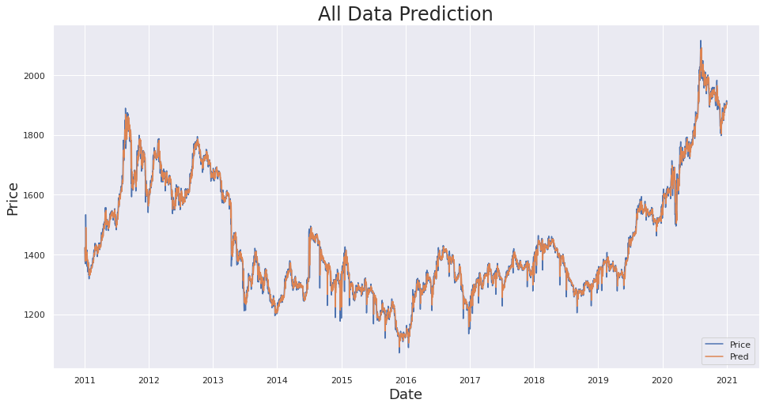

# Gold Futures Price Forecasting Using ARIMA (2011–2021)

## Overview

This project presents a time series forecasting analysis of gold futures prices using the ARIMA (AutoRegressive Integrated Moving Average) model. The analysis is based on historical price data from *Investing.com, covering a full decade from **2011 to 2021*.

Gold, being a crucial economic asset and hedge against inflation, shows fluctuations influenced by global events. By modeling its behavior using ARIMA, this project aims to understand underlying trends and provide accurate short-term forecasts.

## Dataset

- *Source:* [Investing.com](https://www.investing.com)
- *Period:* 2011 – 2021
- *Features Used:* Date, Price
- *Preprocessing Steps:*
  - Parsed date and set as index
  - Resampled data to daily frequency
  - Handled missing values using a 7-day rolling average

## Objectives

1. *Data Cleaning and Transformation:*
   - Convert date formats
   - Fill in missing price values with custom imputation logic
   - Resample to consistent daily intervals

2. *Exploratory Data Analysis:*
   - Visualize historical price trends
   - Identify patterns, seasonality, and anomalies

3. *Modeling:*
   - Apply ADF test to check stationarity
   - Train ARIMA model on 80% of the data
   - Validate using 20% test split

4. *Evaluation:*
   - Plot actual vs predicted prices
   - Visually assess model performance

## Visualizations

Here’s a sample output of the forecasting result using the ARIMA model:

> This plot shows the model's forecast vs the actual gold prices over the testing period.

## Results

- ARIMA provided a solid baseline model for short-term forecasting.
- The model captured the overall trend and seasonal behavior of the time series.
- While performance may vary depending on external global factors, it performs reliably under stable market conditions.

## Key Skills Demonstrated

- *Time Series Analysis*: Understanding trends, stationarity, and lag structure.
- *Data Manipulation*: Efficient use of Pandas for resampling, filtering, and transformation.
- *Statistical Testing*: Conducting ADF tests to verify assumptions for ARIMA.
- *Forecast Modeling*: Building ARIMA with pmdarima and validating forecasts.
- *Visualization*: Leveraging Matplotlib and Seaborn for insightful plots.
- *Problem Solving*: Designing custom imputation for missing data in daily records.

## Tools & Libraries

- Python (Pandas, NumPy, Matplotlib, Seaborn)
- pmdarima, statsmodels
- Google Colab environment

## Conclusion

This project provides a strong foundation in time series forecasting using ARIMA, especially for financial datasets. It demonstrates both technical competence and the ability to apply theory to real-world data.

---

*Note:* This repository contains all the necessary code and datasets to reproduce the analysis. For best experience, run the notebook in Google Colab.
